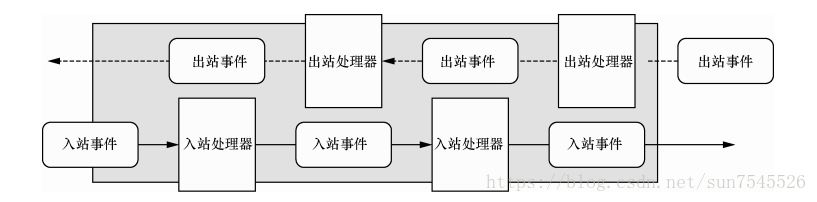

# Netty 介绍
Netty是一个NIO客户端服务器框架，可以快速轻松地开发网络应用程序，极大地简化和简化了诸如TCP和UDP套接字服务器之类的网络编程

## Netty有很多重要的特性，主要特性如下：
- 优雅的设计
- 统一的API接口，支持多种传输类型，例如OIO,NIO
- 简单而强大的线程模型
- 丰富的文档
- 卓越的性能
- 拥有比原生Java API 更高的性能与更低的延迟
- 基于池化和复用技术，使资源消耗更低
- 安全性
- 完整的SSL/TLS以及StartTLS支持

## 资料
- [官网](https://netty.io/)
- [gitee地址](https://gitee.com/mirrors/netty)
- [github地址](https://github.com/netty/netty)

# Netty 事件处理 ChannelHandler
入站事件处理：ChannelInboundHandlerAdapter  Decoder解码器

出站事件处理：ChannelOutboundHandlerAdapter Encoder编码器

# ByteBuf

Netty提供的字节容器，
# 
